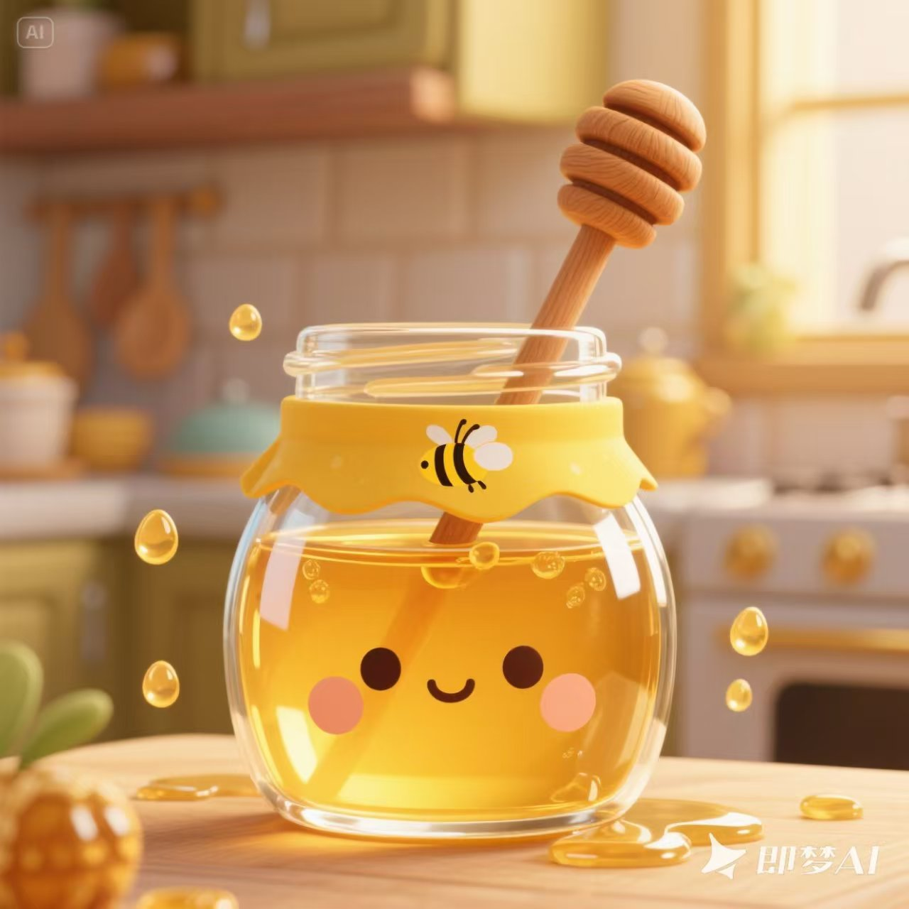

# 游戏5：小熊分蜂蜜 - AI文生图提示词

## 📋 图片规格要求

### 🎯 基础规格
- **分辨率**：512x512px（标准）/ 1024x1024px（高清）
- **格式**：PNG（推荐，支持透明背景）/ WEBP（体积更小）
- **色彩模式**：RGB，色彩深度24位
- **压缩**：无损压缩，保持细节清晰

### 📱 移动端优化
- **最小尺寸**：256x256px（保证清晰度）
- **最大文件大小**：单张不超过500KB
- **响应式**：支持2x、3x像素密度
- **加载优化**：webp格式优先，png作为后备

### 📁 目录结构
```
games/game5/images/
├── characters/
│   ├── bear-main.png (80x80px) - 主角小熊
│   ├── bear-happy.png (80x80px) - 开心状态
│   └── bear-thinking.png (80x80px) - 思考状态
├── elements/
│   ├── honey-jar.png (120x120px) - 蜂蜜罐
│   ├── honey-drop.png (25x30px) - 蜂蜜滴
│   └── minus-icon.png (40x40px) - 减号图标
├── friends/
│   ├── rabbit.png (60x60px) - 兔子朋友
│   ├── squirrel.png (60x60px) - 松鼠朋友
│   └── bird.png (60x60px) - 小鸟朋友
├── backgrounds/
│   ├── forest-bg.jpg (360x640px) - 森林背景
│   └── elements-bg.png (300x200px) - 元素背景
└── ui/
    ├── button-bg.png (60x60px) - 按钮背景
    ├── success-icon.png (40x40px) - 成功图标
    └── level-badge.png (50x50px) - 关卡徽章
```

### 🎨 HTML中的使用方法
```html
<!-- 在HTML的<head>中添加图片预加载 -->
<link rel="preload" as="image" href="./images/characters/bear-main.png">
<link rel="preload" as="image" href="./images/elements/honey-jar.png">

<!-- 在CSS中使用背景图片 -->
.bear-character {
    background-image: url('./images/characters/bear-main.png');
    background-size: cover;
    background-position: center;
}

<!-- 在HTML中使用标签 -->

```

## 主角小熊图片

### 1. 小熊主角 (bear-main.png)
```
A cute cartoon bear character, friendly and warm expression, light brown fur, wearing a small yellow apron with honey bee patterns, sitting position, holding a small honey pot, forest background with green trees and flowers, children's book illustration style, bright and vibrant colors, digital art, high quality, 4K resolution
可爱的卡通小熊角色，友好温暖的表情，浅棕色毛发，穿着带有蜜蜂图案的黄色小围裙，坐姿，手持小蜂蜜罐，森林背景有绿树和花朵，儿童绘本插画风格，明亮鲜艳的色彩，数字艺术，高质量，4K分辨率
```

### 2. 开心的小熊 (bear-happy.png)
```
A joyful cartoon bear with big smile, arms raised in celebration, sparkling eyes, light brown fur, yellow apron, surrounded by golden honey drops and rainbow, cheerful expression, children's illustration style, bright yellow and orange color scheme, magical forest background
开心的卡通小熊，灿烂的笑容，举起双臂庆祝，闪亮的眼睛，浅棕色毛发，黄色围裙，周围有金色蜂蜜滴和彩虹，欢快的表情，儿童插画风格，明亮的黄色和橙色配色方案，魔法森林背景
```

### 3. 思考的小熊 (bear-thinking.png)
```
A thoughtful cartoon bear with finger on chin, contemplative expression, light brown fur, yellow apron, question marks floating around head, honey pot nearby, forest clearing background, children's book art style, warm colors, educational atmosphere
思考中的卡通小熊，手指放在下巴上，沉思的表情，浅棕色毛发，黄色围裙，头部周围飘着问号，旁边有蜂蜜罐，森林空地背景，儿童绘本艺术风格，温暖色调，教育氛围
```

## 朋友角色图片

### 4. 小兔子朋友 (rabbit-friend.png)
```
A cute white cartoon rabbit with long ears, pink inner ears, bright blue eyes, sitting upright, friendly smile, wearing a small green vest, holding carrots, meadow background with flowers, children's illustration style, soft pastel colors, adorable and friendly appearance
可爱的白色卡通兔子，长耳朵，粉色内耳，明亮的蓝眼睛，直立坐姿，友好的笑容，穿着绿色小背心，手持胡萝卜，花朵草地背景，儿童插画风格，柔和的粉彩色，可爱友好的外观
```

### 5. 小松鼠朋友 (squirrel-friend.png)
```
A fluffy cartoon squirrel with bushy tail, reddish-brown fur, bright eyes, sitting on tree branch, holding an acorn, cheerful expression, forest background with oak leaves, children's book illustration style, warm brown and orange colors, nature setting
毛茸茸的卡通松鼠，蓬松的尾巴，红棕色毛发，明亮的眼睛，坐在树枝上，手持橡果，欢快的表情，橡树叶森林背景，儿童绘本插画风格，温暖的棕色和橙色，自然环境
```

### 6. 小鸟朋友 (bird-friend.png)
```
A colorful cartoon bird with bright blue and yellow feathers, small rounded body, cheerful expression, perched on a flower branch, wings slightly spread, forest background with blooming flowers, children's illustration style, vibrant colors, spring atmosphere
色彩斑斓的卡通小鸟，明亮的蓝色和黄色羽毛，圆润的小身体，欢快的表情，栖息在花枝上，翅膀微微张开，盛开花朵的森林背景，儿童插画风格，鲜艳的色彩，春天的氛围
```

## 蜂蜜相关图片

### 7. 蜂蜜罐 (honey-jar.png)
```
A cute cartoon honey jar with golden honey inside, wooden dipper on top, yellow label with bee illustration, transparent glass showing golden honey, small honey drops around, warm lighting, children's book style, golden and amber colors, cozy kitchen atmosphere
可爱的卡通蜂蜜罐，里面装着金色蜂蜜，顶部有木制蜂蜜棒，黄色标签上有蜜蜂插图，透明玻璃显示金色蜂蜜，周围有小蜂蜜滴，温暖的光照，儿童绘本风格，金色和琥珀色，舒适的厨房氛围
```

### 8. 蜂蜜滴 (honey-drops.png)
```
Collection of golden honey drops in various sizes, dripping effect, translucent amber color, shiny surface reflecting light, some drops mid-air, white background, realistic cartoon style, golden yellow and amber tones, sweet and appetizing appearance
各种大小的金色蜂蜜滴集合，滴落效果，半透明琥珀色，闪亮表面反射光线，一些蜂蜜滴在半空中，白色背景，逼真的卡通风格，金黄色和琥珀色调，甜美诱人的外观
```

### 9. 蜜蜂图案 (bee-pattern.png)
```
Cute cartoon bees flying around flowers, black and yellow striped bodies, transparent wings, friendly expressions, flower garden background with various colorful blooms, children's illustration style, bright yellow and black colors, happy and busy atmosphere
可爱的卡通蜜蜂围绕花朵飞舞，黑黄条纹身体，透明翅膀，友好的表情，各种彩色花朵的花园背景，儿童插画风格，明亮的黄色和黑色，快乐忙碌的氛围
```

## 背景装饰图片

### 10. 森林背景 (forest-background.png)
```
A magical cartoon forest with tall green trees, colorful flowers, mushrooms, butterflies, dappled sunlight through leaves, winding path, children's fairy tale illustration style, bright green and earth tones, magical and peaceful atmosphere
魔法卡通森林，高大的绿树，彩色花朵，蘑菇，蝴蝶，树叶间斑驳的阳光，蜿蜒的小径，儿童童话插画风格，明亮的绿色和大地色调，神奇宁静的氛围
```

### 11. 数字装饰 (numbers-decoration.png)
```
Colorful cartoon numbers 0-10 with cute faces and expressions, floating in air with sparkles, rainbow colors, children's educational style, each number with unique personality, mathematical symbols (+, -, =) also included, playful and educational design
彩色卡通数字0-10，带有可爱的面部和表情，在空中飘浮带有闪光，彩虹色彩，儿童教育风格，每个数字都有独特的个性，也包括数学符号（+、-、=），有趣的教育设计
```

### 12. 庆祝烟花 (celebration-fireworks.png)
```
Colorful cartoon fireworks explosion in night sky, stars and sparkles, rainbow colors, celebration atmosphere, magical effect, children's illustration style, bright and festive colors, joyful and exciting mood, party decoration elements
夜空中彩色卡通烟花爆炸，星星和闪光，彩虹色彩，庆祝氛围，魔法效果，儿童插画风格，明亮节日色彩，欢乐激动的情绪，聚会装饰元素
```

## 游戏元素图片

### 13. 答案按钮背景 (button-backgrounds.png)
```
Collection of colorful round button designs for children's games, gradient colors (red-pink, blue-cyan, purple-violet, green-mint), glossy surface, 3D effect, child-friendly design, bright and attractive colors, game UI elements
儿童游戏彩色圆形按钮设计集合，渐变色彩（红粉色、蓝青色、紫罗兰色、绿薄荷色），光滑表面，3D效果，儿童友好设计，明亮吸引人的色彩，游戏UI元素
```

### 14. 成功标志 (success-icons.png)
```
Collection of success and achievement icons for children, golden stars, checkmarks, thumbs up, trophy, medal, crown, smiley faces, rainbow elements, children's cartoon style, golden and bright colors, celebration theme
儿童成功和成就图标集合，金星，对勾，大拇指，奖杯，奖牌，皇冠，笑脸，彩虹元素，儿童卡通风格，金色和明亮色彩，庆祝主题
```

### 15. 关卡进度图标 (level-progress.png)
```
Game level progression icons, numbered badges 1-10, colorful circular designs, progress bar elements, achievement unlocked graphics, children's game UI style, bright rainbow colors, educational gaming theme
游戏关卡进度图标，编号徽章1-10，彩色圆形设计，进度条元素，成就解锁图形，儿童游戏UI风格，明亮的彩虹色彩，教育游戏主题
```

## 使用说明

1. **主要角色图片** - 用于游戏中的主要角色展示
2. **朋友角色图片** - 用于不同关卡中的朋友角色
3. **蜂蜜相关图片** - 用于游戏主题元素
4. **背景装饰图片** - 用于游戏背景和装饰
5. **游戏元素图片** - 用于游戏界面和交互元素

## 色彩方案
- 主色调：金黄色 (#ffd93d)、橙色 (#ff8c00)
- 辅助色：绿色 (#6bcf7f)、蓝色 (#4d9de0)
- 强调色：红色 (#ff6b6b)、紫色 (#a55eea)

## 风格要求
- 卡通风格，适合幼儿园儿童
- 色彩鲜艳明亮
- 友好可爱的角色设计
- 教育性和趣味性并重 